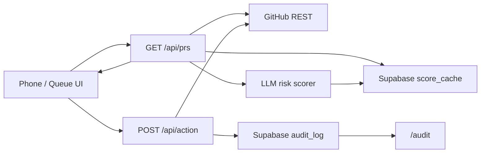

# Mission Control — every agent supervised.

**The review layer for the software factory: agents build, humans stay in command.**

A mobile-first web app that risk-scores pull requests from autonomous coding agents and lets a human approve or reject them from a phone — in one tap, with a paper trail.

---

## The problem

Agents are getting autonomy faster than we are getting oversight.

They open PRs at machine speed. Diffs land while you're away from a keyboard. Merge buttons sit one mis-tap from production. The failure mode isn't theoretical: a founder's agent once deleted his Git history. Autonomy without a review layer is just unsupervised write access with better marketing.

Mission Control is that layer — green / amber / red on a phone, confirmation on high risk, every decision logged.

---

## How it works

1. **Fetch** open PRs from the supervised repo (`GITHUB_TARGET_REPO`).
2. **Score** each diff with an LLM using the prompt in [`prompts/risk-scorer.md`](prompts/risk-scorer.md) — results cached in Supabase.
3. **Review** a one-tap mobile queue: green / amber / red, with a confirmation gate on high-risk PRs.
4. **Act & audit** — approve or reject via GitHub; every action lands in a Supabase `audit_log`, visible on `/audit`.

---

## Architecture

| Layer | Choice |
|---|---|
| App | Next.js 14 App Router on Vercel |
| Source of truth | GitHub REST API |
| Risk brain | LLM scorer (Anthropic or Grok) |
| Persistence | Supabase — `audit_log`, `score_cache` |



**Data flow:** `/api/prs` → adapters (GitHub + LLM + cache) → queue UI → `/api/action` → `/audit`.

Deeper sketch: [`docs/architecture.md`](docs/architecture.md).

---

## Built by the thing it supervises

Mission Control was built the way it expects the world to work: **agents ship, a human stays in command.**

Nine Cursor cloud agents + a Claude risk-scoring stream ran in parallel under a locked-spine plan ([`hack-build/PLAN.md`](hack-build/PLAN.md)) — file ownership matrix, frozen contracts, collision-free streams. Direction came from a phone. The product is the oversight layer; the build is the proof that oversight scales.

---

## Setup

### Environment variables

Names only — values live in Vercel / your local `.env` (never commit secrets):

| Variable | Purpose |
|---|---|
| `GITHUB_TOKEN` | GitHub API auth for PR fetch / approve / reject |
| `GITHUB_TARGET_REPO` | Repo to supervise (`owner/repo`) |
| `SUPABASE_URL` | Supabase project URL |
| `SUPABASE_ANON_KEY` | Supabase anon/public key |
| `SUPABASE_SERVICE_KEY` | Supabase service role key (server-side) |
| `LLM_API_KEY` | Anthropic or Grok API key for risk scoring |

### Database

Run [`supabase/schema.sql`](supabase/schema.sql) once in the Supabase SQL editor (`audit_log` + `score_cache`).

### Local

```bash
npm i && npm run dev
```

Open [http://localhost:3000](http://localhost:3000). Demo-day runbook: [`docs/demo-script.md`](docs/demo-script.md).

---

## Judging criteria

| Criterion | How Mission Control maps |
|---|---|
| **Autonomy** | Agents open and land PRs at machine speed; the human only intervenes at the decision boundary. |
| **Safety & oversight** | LLM risk scores, color-coded queue, confirmation gate on high risk, immutable audit trail. |
| **Technical execution** | Next.js 14 · Vercel · GitHub REST · LLM scorer · Supabase cache + audit — end-to-end live path. |
| **UX clarity** | Mobile-first control room: risk color as the primary language, big touch targets, one-tap approve/reject. |
| **Real-world applicability** | Any team running coding agents against a real repo needs a phone-reachable review layer before merge. |
| **Best use of Cursor** | Built *by* Cursor cloud agents in parallel under a locked spine — the product supervises the same class of agent that shipped it. |
