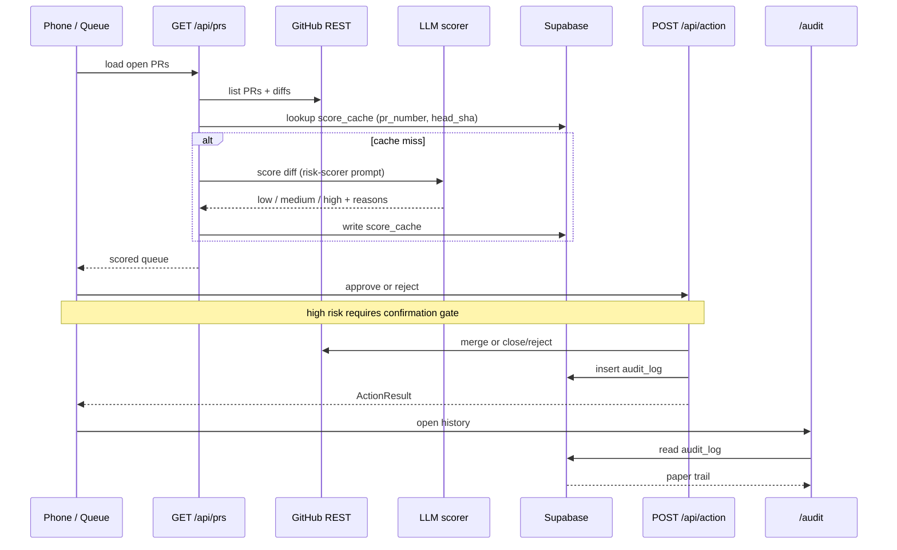

# Architecture — Mission Control

Judge-facing sketch of how the review layer is wired. Implementation lives under `app/`, `lib/`, and `components/`; this doc is the map, not the code.

---

## Stack

| Piece | Role |
|---|---|
| **Next.js 14 App Router** | Mobile web UI + API routes, deployed on **Vercel** |
| **GitHub REST API** | Fetch open PRs; approve (merge) / reject |
| **LLM scorer** | Risk-score each diff (prompt: [`prompts/risk-scorer.md`](../prompts/risk-scorer.md)) |
| **Supabase** | `score_cache` (idempotent scoring) + `audit_log` (paper trail) |

Env var **names** (values never in git): see [README Setup](../README.md#setup) / `AGENTS.md`.

---

## Components (logical)

```text
┌─────────────────────────────────────────────────────────────┐
│  Phone UI                                                   │
│  Landing  ·  Review queue (green/amber/red)  ·  /audit      │
└───────────────┬─────────────────────────────┬───────────────┘
                │                             │
                ▼                             ▼
         GET /api/prs                  POST /api/action
                │                             │
        ┌───────┴────────┐            ┌───────┴────────┐
        │ Adapters       │            │ Action route   │
        │  · GitHub read │            │  · GitHub write│
        │  · LLM score   │            │  · audit_log   │
        │  · score_cache │            └────────────────┘
        └────────────────┘
```

---

## Data flow



**One-liner:** `/api/prs` → adapters → queue UI → `/api/action` → `/audit`.

---

## Persistence

Defined in [`supabase/schema.sql`](../supabase/schema.sql) — run once in the Supabase SQL editor.

| Table | Purpose |
|---|---|
| `score_cache` | Cache LLM scores keyed by `(pr_number, head_sha)` so reloads don’t re-burn tokens |
| `audit_log` | Every approve/reject: PR metadata, risk level, score, reasons, timestamp |

---

## Safety design (product, not auth)

- **Risk color as primary language** — green / amber / red on large touch targets.
- **Confirmation gate on high risk** — red never one-taps through.
- **Audit trail** — decisions are queryable on `/audit`, not lost in chat history.
- **Single-operator demo** — no end-user auth; the supervised surface is the GitHub token + target repo.

---

## How it was built

Parallel Cursor cloud agents under a locked-spine plan ([`hack-build/PLAN.md`](../hack-build/PLAN.md)): frozen types, schema, and file ownership so nine streams could ship without colliding. The architecture above is what those streams assembled; Mission Control is both the product and the demo of supervised agent throughput.
